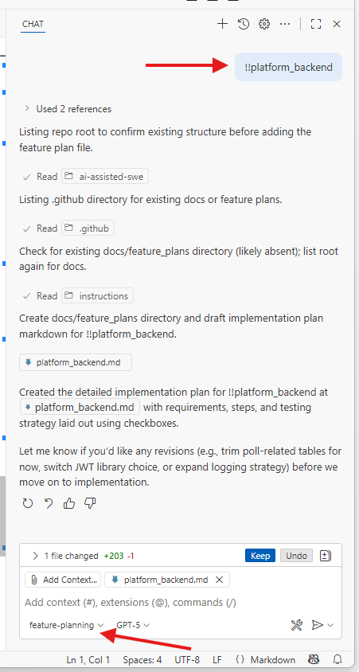

# AI-Assisted Software Engineering

> [!NOTE]  
> Fast forward: If you're action oriented, you can clone this repo, and using github copilot, start building out the requirements using the tools provided, as is.

This repository demonstrates a structured, repeatable approach to building software using AI assistance, emphasizing clear separation between:

1. High-level product requirements (single authoritative source)
2. Feature planning (per-feature implementation plans with checklists)
3. Incremental feature implementation (executed against those plans)
4. Validation (tests, structure, consistency, traceability)

The goal: Show other engineers how AI can collaborate as a disciplined implementation partner, not a code dump generator, while preserving engineering rigor, transparency, and maintainability.

## Core Concepts

| Concept | Description | Artifacts |
|---------|-------------|-----------|
| Product Requirements | Master functional & non-functional requirements with stable identifiers | `.github/instructions/requirements.instructions.md` |
| Coding Standards & Guardrails | Enforced conventions for naming, structure, testing | `.github/instructions/copilot-instructions.md` |
| Feature Identifier | Unique tag (e.g. `!!platform_backend`) used to link requirement → plan → implementation PR | Present inline in requirements file |
| Feature Planning Mode | Creates/updates a detailed Markdown plan with actionable checklists | `.github/chatmodes/feature-planning.chatmode.md` |
| Feature Implementation Mode | Executes the plan incrementally, checking off items as delivered | `.github/chatmodes/feature-implementation.chatmode.md` |
| Feature Plan Documents | Living design + execution ledger (status checkboxes) | `docs/feature_plans/*.md` |
| Traceability | Requirement → Plan → Code → Tests → README narrative | Consistent naming & links |

## Repository Structure (Template)

```
.
├── .github/
│   ├── chatmodes/
│   │   ├── feature-planning.chatmode.md
│   │   └── feature-implementation.chatmode.md
│   └── instructions/
│       ├── copilot-instructions.md
│       └── requirements.instructions.md
├── docs/
│   └── feature_plans/
│       └── platform_backend.md
└── README.md (this file)
```

As the application is implemented, `backend/` and `frontend/` directories will be introduced per the requirements.

## Workflow Overview

1. Identify a requirement section in `requirements.instructions.md` (e.g. `!!platform_backend`).
2. Enter Feature Planning Mode (using the defined chat mode) to create or update `docs/feature_plans/<identifier>.md`.
3. The plan MUST include:
   - Overview
   - Requirements (checkboxes)
   - Implementation Steps (checkboxes)
   - Testing Strategy (checkboxes: unit, integration, manual)
4. Enter Feature Implementation Mode to execute the plan:
   - Implement in small, testable increments
   - Check off items in the plan as they are completed
   - Avoid marking everything done in a single batch
5. Update the feature plan with a Final Design Summary once the feature is complete.
6. Repeat for the next feature (prioritize platform foundations, then vertical slices).

This ensures predictability, auditability, and minimal architectural drift.

# Requirement Identifiers ("!! Tags")

Each requirement in `requirements.instructions.md` includes an inline identifier (e.g. `!!auth_basic`, `!!poll_finalization`). These serve as stable anchors for:
* Plan filename: `docs/feature_plans/<identifier>.md`
* Commit / PR references
* Cross-feature dependency tracking

## Chat Modes Explained

### Feature Planning Mode
File: `.github/chatmodes/feature-planning.chatmode.md`
Purpose: Generate or update a detailed plan. Guardrails enforce design-first thinking.
Key behaviors:
* No code modifications outside `docs/feature_plans/`
* All actionable items expressed as checkboxes
* Encourages optional trade-off discussion

### Feature Implementation Mode
File: `.github/chatmodes/feature-implementation.chatmode.md`
Purpose: Execute the plan incrementally.
Key behaviors:
* Enforces referencing an existing plan
* Requires progressive checklist completion
* Appends final design summary after completion

## Engineering Principles Embedded

* SOLID & Layered Architecture: Encouraged in plans & enforced by directory structure.
* Minimal Stub Forward Design: Build only enough to enable future features without rework.
* Uniform API Envelope: `{ data, meta, errors }` (planned early to prevent inconsistency).
* Idempotent Feature Phases: Each plan aims to be mergeable independently.
* Documentation as Ledger: Plans double as execution records.

These are just examples of what I did in the [copilot-instructions.md](.github/instructions/copilot-instructions.md), but you can and should adapt to your project.

## Testing Philosophy

Testing is defined before (or alongside) implementation in the plan documents:
* Unit tests for service & utility layers
* Feature tests for API contract
* Manual test checklist for environment validation
* Future CI pipeline will run automated migrations + tests per feature

## Test it for yourself!

### Example Feature Plan

The initial scaffold plan: `docs/feature_plans/platform_backend.md` (identifier: `!!platform_backend`).

This was generated using the [feature-planning.chatmode.md](.github/chatmodes/feature-planning.chatmode.md), and it demonstrates the execution of a feature from the [requirements.instructions.md](.github/instructions/requirements.instructions.md)




### Run the feature-implementation chatmode

Now that the plan is in place, you can run the feature-implementation chatmode to execute on that plan.


After the `!!platform_backend` feature is implemented, review it and see if it adhered to the feature plan document [docs/feature_plans/platform_backend.md](docs/feature_plans/platform_backend.md)
